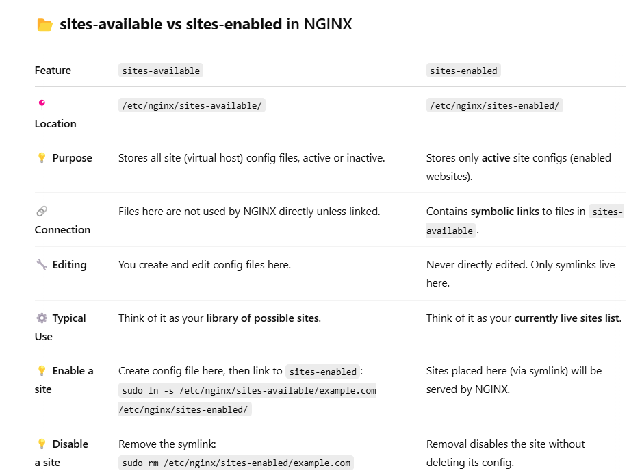

# NGINX BASICS
NGINX is a high-performance, open-source web server which serves static content. It uses an event-driven, asynchronous architecture which makes it highly efficient and scalable.

## FEATURES:
1. Reverse Proxy
2. Load Balancing
3. URL Redirecting
4. Caching
5. Indexing
6. gzip compression.
7. Provides SSL/TLS termination for secure communication.
8. Rate limiting, IP filtering, and basic security configurations.
9. Supports WebSockets and Real-time applications.


## Windows:
nginx runs on below in windows:

 - http://localhost/       --> Default Page (Inside html folder)  [PORT 80]
 - http://localhost:8080/  --> Custom Page (Inside htdocs folder) [PORT 8080]


## Installation on Ubuntu:

```
sudo apt install nginx -y
```

```
systemctl status nginx
```

```
sudo systemctl restart nginx

```

## About some files:
```
cd /var/www/html  
ls  
```
         
 - `index.nginx-debian.html:` Default Page of nginx in Ubuntu


```
cd /etc/nginx/
ls
```

 - `nginx.conf:` Present inside conf folder and contains global configuration for NGINX server
 - `sites-enabled:` default; Specific config for a single website or virtual host
 - `sites-available`

See: 
- [nginx_my.conf](nginx_my.conf)
- [nginx.conf](nginx.conf)
.png)



## COMMANDS OF NGINX: 
Run these commands from "C:\" Path

### Version of nginx
```
nginx -v 
```

### Start nginx
```
start nginx 
```

### Fast Shutdown
```
nginx -s stop 
```

### Graceful Shutdown
```
nginx -s quit 
```

### Changing configuration, starting new worker processes with a new configuration, graceful shutdown of old worker processes
```
nginx -s reload 
```

### Re-opening log files
```
nginx -s reopen 
```

### Location of nginx.exe
```
where nginx
```

### Help
```
nginx -h 
```

## Author
Abhishek Rajput


